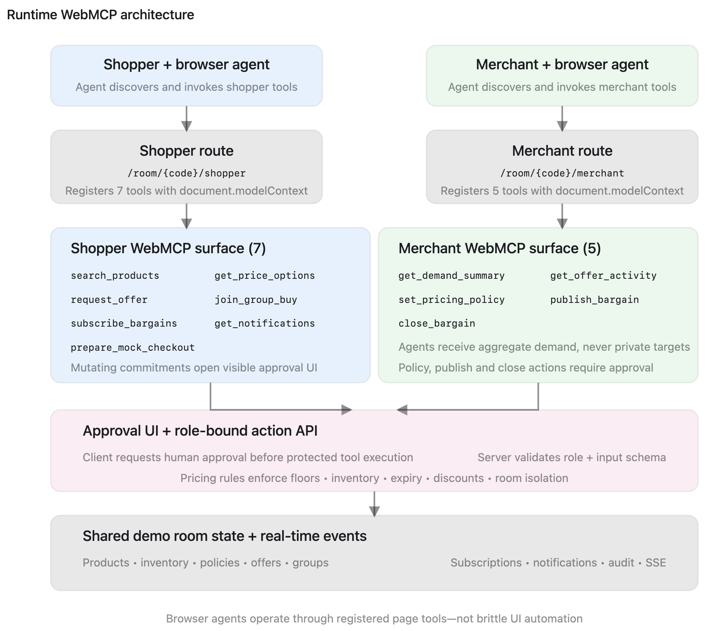

# LitghtningPricePilot — Agentic Price Discovery and Negotiation

LitghtningPricePilot is a WebMCP-enabled laptop marketplace built for a Devpost competition. It lets a browser agent and a person collaborate across product discovery, refurbished pricing, policy-bound negotiation, group buying, bargain subscriptions, proactive merchant notifications, and a human-approved mock checkout.

The app intentionally has no embedded model and no OpenAI API key. Open the deployed storefront in ChatGPT's WebMCP-capable browser; the page registers structured tools with `document.modelContext.registerTool`.

## Stack

- Next.js 16 App Router, React, TypeScript
- Tailwind CSS and local shadcn-style components
- React Icons
- Drizzle ORM with Neon Serverless Postgres
- Server-Sent Events with a persisted event outbox
- Vitest and Playwright
- Render paid `1c-2g` web compute

## Architecture



- [Diagram - Two-sided bargain loop](docs/two-sided-bargain-loop.png)
- [Diagram - Actors](docs/actors.png)
- [Diagram - Use case](docs/use-case.png)

## Local setup

1. Create a Neon project and copy both connection strings:
   - Pooled URL for runtime traffic.
   - Direct URL for migrations.
2. Copy `.env.example` to `.env.local` and replace both placeholders.
3. Install dependencies and migrate:

   ```bash
   npm install
   npm run db:migrate
   npm run dev
   ```

4. Open `http://localhost:3000`, create a room, and use the role switcher to move between shopper and merchant views.

The first room seeds eight fictional laptops and a four-person Aster Air group. The fifth group commitment unlocks the first discount during the demo.

## WebMCP tool surface

Shopper pages register:

- `search_products`
- `get_price_options`
- `request_offer`
- `join_group_buy`
- `subscribe_bargains`
- `get_notifications`
- `prepare_mock_checkout`

Merchant pages register:

- `get_demand_summary`
- `get_offer_activity`
- `set_pricing_policy`
- `publish_bargain`
- `close_bargain`

Write tools accurately set `readOnlyHint: false`. Commitments and merchant mutations pause in a visible confirmation dialog. Merchant-authored messages set `untrustedContentHint: true`.

## Verification

```bash
npm run lint
npm run typecheck
npm test
npm run build
```

With a configured test database:

```bash
npm run test:e2e
```

## Deploy to Render with Neon

1. Push this repository to a private GitHub repository.
2. Create a Neon Free project in AWS US West Oregon.
3. In Render, create a Blueprint from `render.yaml` in a Hobby workspace.
4. Enter `DATABASE_URL` and `DIRECT_DATABASE_URL` when Render prompts for unsynced secrets.
5. Confirm the web service uses paid `1c-2g` compute.
6. After deployment, check:
   - `/api/health` for Render liveness.
   - `/api/ready` to wake and verify Neon.
7. Run the walkthrough in [docs/demo-guide.md](docs/demo-guide.md).

Never commit either Neon connection string. The paid Render service stays awake; Neon Free may scale to zero and wake on the first database request.

## Safety and demo boundaries

- All products, prices, bargains, and orders are fictional.
- No login, payment, personal information, email, or push service is used.
- Room codes isolate each user's state and can be shared across separate shopper and merchant agent sessions.
- Shopper tools never receive private merchant floors or individual subscriber data.
- A room can be reset to a known state at any time.
